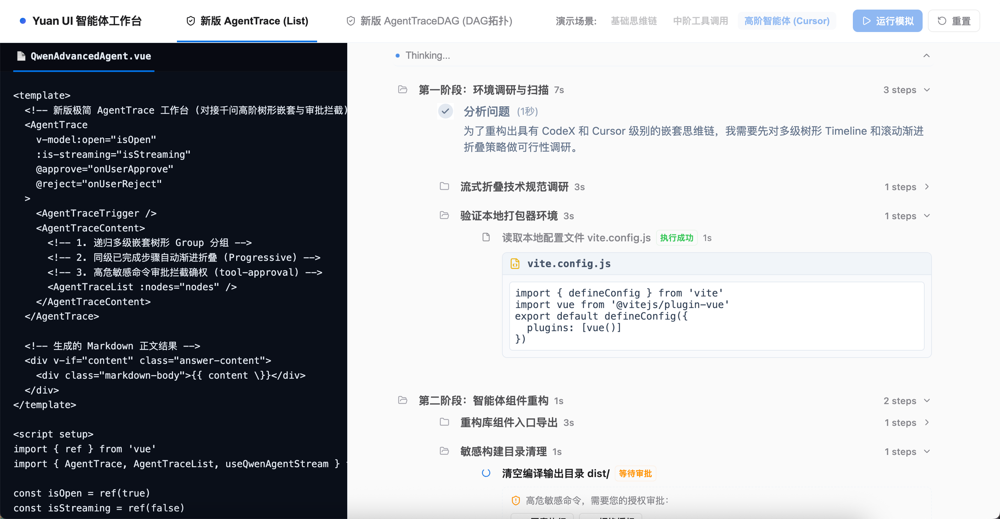
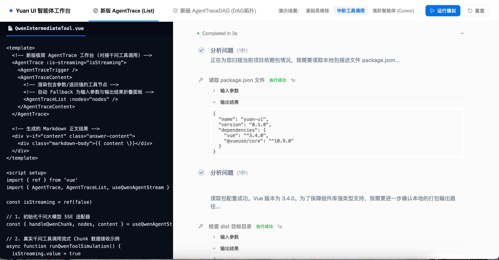

# AiStream-vue ⚡

<p align="center">
  <a href="https://aoyia.github.io/aistream-vue/">
    
  </a>
  &nbsp;&nbsp;
  <a href="https://github.com/Aoyia/aistream-vue/actions/workflows/deploy-demo.yml">
    
  </a>
</p>

<p align="center">
  <a href="https://github.com/Aoyia/aistream-vue/actions/workflows/deploy-demo.yml">
    
  </a>
  <a href="https://github.com/Aoyia/aistream-vue">
    
  </a>
  <a href="https://vuejs.org/">
    
  </a>
  <a href="https://github.com/Aoyia/aistream-vue">
    
  </a>
</p>

AiStream-vue 是一套完全数据驱动、面向高阶 AI Agent 场景开发的 Vue 3 思维链与执行轨迹 UI 组件库。具有多级分组（Grouping）嵌套、同级渐进式流式折叠（Progressive Collapse）、内置语义化高级渲染器（Terminal/Diff/Search/File）以及双向 Human-in-the-loop 审批确权能力。

---

## ✨ 核心特性

- 🌳 **多层级分组树 (Grouping)**：支持大步骤包裹子步骤的级联 Timeline 嵌套渲染，提供 IDE 样式的引导虚线（Dashed Guideline）和左侧对齐缩进，完美表达复杂的 Agent 长链路多轮执行。
- 📉 **同级渐进式折叠 (Progressive Collapse)**：采用同级注意力坍缩算法。当任意层级下开启新的活跃（`active`）节点或子分组时，自动将该层级下所有已经处于 `complete` 状态的旧同级步骤收纳折叠，保证用户的阅读焦点始终位于当前活跃区。
- 💻 **内置高级语义渲染器**：对于高频工具（终端命令、Unified Diff 代码修改、Web 搜索结果、文件读取），专门设计了轻量级专用美学面板，摆脱裸 JSON 堆积。
  - **Terminal 终端**：支持 ANSI 颜色代码（彩色日志），自带滚动自适应。
  - **Unified Diff**：红绿底色行级对比，自带行号。
  - **网页搜索**：卡片式列表，附带外链跳转与域名缩写。
  - **文件阅读**：自动扩展名 Icon 判定，大文件前 10 行预览剪裁。
- 🛡️ **Human-in-the-loop 审批流**：在 Agent 执行敏感或高危操作（如 Shell 命令或关键写入）时发起审批拦截，UI 渲染"同意"与"拒绝"控制按钮，闭环传递用户操作决策。
- 🎨 **全局主题变量定制**：完全抽取公共 CSS 变量设计，允许一键换肤或主题变量复写。

---

## 🖼️ 效果预览

**高阶场景** — 多级 Group 嵌套 + 文件语义渲染 + 审批确权拦截



**中阶场景** — 工具调用 + JSON 自动 Fallback 折叠渲染



---

## 📦 安装

可以使用你最喜爱的包管理器安装：

```bash
npm install aistream-vue @lucide/vue @vueuse/core
# 或者
pnpm add aistream-vue @lucide/vue @vueuse/core
```

---

## 🚀 快速开始

在你的入口文件或页面中引入主 CSS 样式和核心 API：

```vue
<script setup lang="ts">
import { ref } from 'vue'
import {
  AsThoughtChain,
  AsThoughtChainTrigger,
  AsThoughtChainContent,
  AsThoughtChainList,
  useAsThoughtChainStream
} from 'aistream-vue'

// 导入主样式表 (含主题变量)
import 'aistream-vue/dist/style.css'

const isOpen = ref(true)
const trace = useAsThoughtChainStream()

// 模拟事件派发
trace.handleTraceEvent({ type: 'group-start', id: 'g-1', title: '环境初始化' })
trace.handleTraceEvent({ type: 'tool-input-start', id: 't-1', toolName: 'read_file', title: '读取配置', parentId: 'g-1' })
trace.handleTraceEvent({ type: 'tool-output', id: 't-1', output: 'content: ...' })
trace.handleTraceEvent({ type: 'group-end', id: 'g-1' })
trace.handleTraceEvent({ type: 'finish' })
</script>

<template>
  <div class="assistant-message-bubble">
    <AsThoughtChain
      v-model:open="isOpen"
      :is-streaming="trace.isStreaming.value"
      :duration="trace.duration.value"
    >
      <AsThoughtChainTrigger />
      <AsThoughtChainContent>
        <AsThoughtChainList :nodes="trace.nodes.value" />
      </AsThoughtChainContent>
    </AsThoughtChain>
  </div>
</template>
```

---

## 🛠️ 主题定制

你可以在项目本地的 CSS 中覆盖 AiStream-vue 暴露的 CSS 自定义变量：

```css
:root {
  --yuan-primary: #8b5cf6;       /* 主题色更改为紫色 */
  --yuan-primary-hover: #7c3aed;
  --yuan-radius: 12px;           /* 更加圆润的卡片 */
}
```

---

## 📄 License

[MIT](LICENSE) License.
