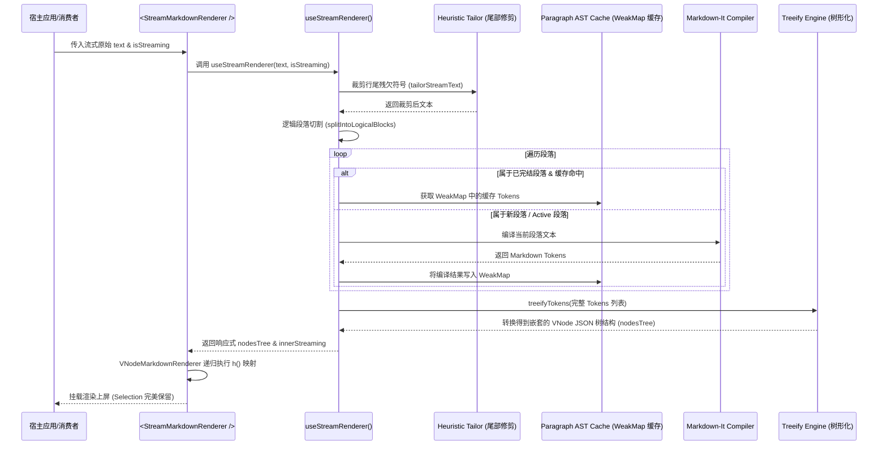

# 流式 Markdown 虚拟 DOM 渲染组件 (StreamMarkdownRenderer) 设计 PRD & 技术说明文档

> **面向后续开发 AI 的提示**：本组件专为 AI 流式文本渲染场景设计。由于流式打字会导致文本频繁变化，如果直接使用传统的 Markdown 渲染，会导致 DOM 树频繁销毁重构，造成页面闪烁、输入框抖动、以及用户鼠标划选文字时选区中断等严重体验问题。
> 
> 本文档定义了如何将 `demo-vnode-runtime.html` 中的成熟方案抽离成 `yuan-ui` 组件库的通用组件。请严格按照本文档的技术规格和接口定义进行编码。

---

## 1. 核心需求与设计目标 (PRD)

### 1.1 痛点分析
在 AI 聊天或工作流执行过程中，流式输出的文本会随着时间增量增加。常规渲染方案有两大缺陷：
1. **Selection（划选）中断**：使用 `v-html` 或每次全量生成新组件渲染时，Vue 会将旧的 DOM 节点全部销毁并创建新节点，使用户鼠标在阅读过程中划选复制的操作被强制中断（选区消失）。
2. **布局闪烁与抖动**：流式打字中，未完成的 Markdown 语法（如行尾的 `\n>`、`*`、`\x60\x60\x60`）会被误解析为临时块级元素，造成渲染内容在 60 帧内反复跳动。

### 1.2 核心特性要求
1. **文本节点 Value 级增量更新**：渲染层必须基于 Vue 3 的 `h()` 渲染函数，将普通文本映射为纯 `DxfText` 组件（返回原始 String），使得流式追加文本时，Vue 仅触发 nodeValue 的局部更新，绝不重构物理节点，Selection 状态得以完美保留。
2. **段落级 WeakMap AST 缓存**：采用 WeakMap 缓存已完整生成的历史段落对应的 Markdown Tokens，只有当前正在输入的最末尾段落执行增量编译，避免长文本下的解析性能雪崩，保持 FPS 稳定在 60 帧。
3. **启发式尾部修剪 (Heuristic Tailoring)**：在把流式文本交给编译器前，自动识别并临时剔除行尾残缺的标签及 Markdown 符号（如孤立的列表符、引用符、代码块半开启反引号等），消除 DOM 闪烁重排。
4. **双缓冲区与 RAF 帧合并**：引入非响应式临时缓存区并结合 `requestAnimationFrame`（RAF），将高频的打字机输入节流合并至物理刷新帧，降低 Vue 的 VNode Diff 频率。
5. **安全沙箱与自我纠错 (配置项/可选插件)**：
   - 提供基于 VNode 级别的标签白名单拦截。
   - 提供组件报错时触发纠错反馈的事件通道。

---

## 2. 系统架构设计 (Architecture)

采用 **Composable（分析逻辑层） + Component（渲染视图层）** 双层隔离设计。

### 2.1 整体时序与数据流



---

## 3. 技术细节与核心算法实现规范

### 3.1 启发式尾部修剪 (Heuristic Tailoring)
**逻辑说明**：如果流式文本正在输出中，需要在编译前对文本尾部进行正则扫描。
- **HTML 标签裁剪**：检测尾部是否包含 `<dxf-` 但未闭合的半残标签，若有，将其截断至该标签前。
- **引用符裁剪**：若以 `\n>` 或 `\n> ` 结尾，临时切掉该末尾字符。
- **无序列表符裁剪**：若以 `\n-` 或 `\n- `、`\n*`、`\n* ` 结尾，临时切掉该末尾字符。
- **代码块反引号裁剪**：若尾部包含连续的 1 个或 2 个 \x60（反引号），临时裁剪。

**核心算法实现：**
```typescript
function tailorStreamText(text: string, isStreaming: boolean): string {
  if (!isStreaming || !text) return text
  
  // 1. 过滤行尾残欠的 HTML 自定义标签声明
  const tagIndex = text.lastIndexOf('<dxf-')
  if (tagIndex !== -1) {
    const remaining = text.slice(tagIndex)
    if (!remaining.includes('>')) {
      return text.slice(0, tagIndex)
    }
  }

  let tailored = text

  // 2. 引用块修剪
  if (tailored.endsWith('\n>') || tailored.endsWith('\r>')) {
    tailored = tailored.slice(0, -1)
  } else if (tailored.endsWith('\n> ') || tailored.endsWith('\r> ')) {
    tailored = tailored.slice(0, -2)
  }

  // 3. 无序列表修剪
  if (tailored.endsWith('\n-') || tailored.endsWith('\n*')) {
    tailored = tailored.slice(0, -1)
  } else if (tailored.endsWith('\n- ') || tailored.endsWith('\n* ')) {
    tailored = tailored.slice(0, -2)
  }

  // 4. 代码块符号修剪 (反引号)
  const lastCodeIndex = tailored.lastIndexOf('`')
  if (lastCodeIndex !== -1) {
    const afterLastCode = tailored.slice(lastCodeIndex)
    if (/^`{1,2}$/.test(afterLastCode)) {
      tailored = tailored.slice(0, lastCodeIndex)
    }
  }

  return tailored
}
```

### 3.2 段落级 WeakMap AST 缓存与切块
**逻辑说明**：为了防止文本变长时 `markdown-it` 全量解析导致的 O(N) 级别计算阻塞，需要进行段落切割。
1. **段落分割**：将文本按行分割，如果在代码块外部且遇到空行，或者是一行独立的 `<dxf-` 标签，则将其判定为一个独立的段落块。
2. **Active 态判断**：当且仅当处于流式传输中，且是最后一个段落时，认为它处于 Active 态（不缓存，每次实时编译）。
3. **WeakMap 键引用**：由于 WeakMap 的键必须是对象，我们需要在内存中维护一个段落对象数组：
   `let paragraphObjects: { text: string }[] = []`
   如果段落文本改变，更新该对象引用并从 WeakMap 移除旧键，否则继续复用对应的 Token 缓存。

### 3.3 扁平 Tokens 树形重组化 (Treeify)
Markdown-it 编译输出的 Tokens 是扁平的（含有 `nesting: 1` 开启标签，`nesting: -1` 关闭标签）。
我们需要编写一个 `treeifyTokens` 递归函数，将其转化为带有 `children` 的 VNode 节点树，供 Vue 渲染器使用：
- **普通元素 (nesting === 1)**：开启一个自定义的标签组件，例如将 `p` 映射为 `dxf-paragraph`，将 `h1` 映射为 `dxf-heading` (带 level props)，并压入解析栈。
- **关闭元素 (nesting === -1)**：将解析栈出栈。
- **自定义组件标签 (e.g. `<dxf-bar-chart>`)**：解析出属性键值对（例如用正则获取 `dataset` 属性的 JSON 串），作为叶子节点直接插入当前栈顶父节点的 `children` 中，不需要压栈。
- **代码块 (fence)**：转换为 `dxf-code-block` 节点类型。
- **行内代码 (code_inline)**：转换为 `dxf-inline-code` 节点类型。

### 3.4 纯 VNode 递归映射渲染器
在 Vue 组件内层，编写一个函数式或微型 VNode 渲染组件，使用 Vue 3 原生的 `h()` 函数：
- `DxfText` 必须使用函数式组件：`() => props.content`。Vue 3 会将其解析为原生文本节点 `TextNode`。
- 其他 VNode（`dxf-paragraph`、`dxf-heading` 等）可以通过对应的封装组件或 HTML 原生元素渲染，使用 Vue 的插槽机制递归传递 `children` 渲染：
  ```typescript
  h(componentClass, node.props || {}, {
    default: () => h(VNodeMarkdownRenderer, { nodes: node.children })
  })
  ```

---

## 4. 接口规范与参数定义 (TypeScript API)

### 4.1 数据模型定义

```typescript
export type RendererNodeType = 'text' | 'element' | 'component'

export interface RendererBaseNode {
  type: RendererNodeType
}

export interface RendererTextNode extends RendererBaseNode {
  type: 'text'
  content: string
}

export interface RendererElementNode extends RendererBaseNode {
  type: 'element'
  tag: string
  props?: Record<string, any>
  children: RendererNode[]
}

export interface RendererComponentNode extends RendererBaseNode {
  type: 'component'
  tag: string
  props: Record<string, any>
}

export type RendererNode = RendererTextNode | RendererElementNode | RendererComponentNode
```

### 4.2 Composable API: `useStreamRenderer`
```typescript
export interface UseStreamRendererOptions {
  /** 是否启用流式输出修剪 */
  enableTailoring?: boolean
  /** 允许挂载的自定义组件白名单 */
  allowedComponents?: string[]
}

export function useStreamRenderer(options?: UseStreamRendererOptions): {
  /** 解析并渲染得到的 VNode JSON 树结构 */
  nodesTree: Ref<RendererNode[]>
  /** 双缓冲区节流渲染所得的文本内容 */
  renderedText: Ref<string>
  /** 输入文本流，由消费者实时追加或赋新值 */
  updateStream: (text: string, isStreaming: boolean) => void
  /** 重置缓冲区与 AST 缓存 */
  reset: () => void
}
```

### 4.3 组件 API: `<StreamMarkdownRenderer />`

**Props**:
| 属性名 | 类型 | 必填 | 默认值 | 说明 |
|---|---|---|---|---|
| `text` | `string` | 是 | `""` | 实时传入的 Markdown 文本或流式文本段 |
| `isStreaming` | `boolean` | 否 | `false` | 是否处于流式生成状态（激活尾部修剪） |
| `allowedComponents` | `string[]` | 否 | `['dxf-bar-chart']` | 自定义组件挂载白名单，不在白名单的标签会被降级渲染 |
| `enableCache` | `boolean` | 否 | `true` | 是否启用段落级 WeakMap AST 缓存 |
| `enableTailoring` | `boolean` | 否 | `true` | 是否启用启发式尾部防闪烁修剪 |

**Events**:
| 事件名 | 载荷参数 | 说明 |
|---|---|---|
| `feedback` | `errorMessage: string` | 子组件校验（如 Zod 校验）失败时回喂错误，用于大模型 Self-Correction 机制 |
| `render-complete` | `-` | 渲染就绪且流式结束时触发 |

---

## 5. 面向“后续开发AI”的保姆级开发任务清单 (TDD)

> **开发 AI 必须严格执行以下小步迭代逻辑：**

### 任务 1: 创建数据模型及核心工具函数
1. **创建文件**：`src/components/StreamMarkdownRenderer/types.ts`
   - 定义所有的 `RendererNode` 联合类型和 Options 类型。
2. **创建文件**：`src/components/StreamMarkdownRenderer/utils/tailor.ts`
   - 实现 `tailorStreamText(text, isStreaming)` 函数。
   - **TDD 单元测试验证**：编写测试用例，输入 `"这是列表\n- "` 且 `isStreaming = true`，验证返回值是否去除了末尾的 `-`；输入已闭合与未闭合标签，验证是否能完美截断。
3. **创建文件**：`src/components/StreamMarkdownRenderer/utils/block-parser.ts`
   - 实现 `splitIntoLogicalBlocks(text)` 逻辑。确保多行代码块内部不被空行切断。

### 任务 2: 实现 AST Token 编译与树形化 (Treeify)
1. **创建文件**：`src/components/StreamMarkdownRenderer/utils/treeify.ts`
   - 实现 `treeifyTokens(tokens)`。
   - 特别处理：`<dxf-bar-chart>` 属性参数解析，将单引号/双引号中的键值正确转换为 props 对象。
   - 特别处理：`fence` 代码块转换为统一的 `dxf-code-block` 结构。
   - **TDD 单元测试验证**：输入模拟的 markdown-it tokens 数组，确认输出的树形结构能够准确表达层级嵌套，且叶子节点属性解析无误。

### 任务 3: 构建 useStreamRenderer 核心 Composable
1. **创建文件**：`src/components/StreamMarkdownRenderer/useStreamRenderer.ts`
   - 引入 `markdown-it`。
   - 实例化 `WeakMap` 作为段落缓存，初始化 `paragraphObjects` 引用。
   - 引入 RAF 调度双缓冲区：`updateFrame` 回调，减少实时打字渲染损耗。
   - 整合 `tailorStreamText`、`splitIntoLogicalBlocks` 和 `treeifyTokens`。
   - **测试验证**：流式写入一段 Markdown 字符，打印 WeakMap 命中率，检查 `nodesTree` 属性是否能呈增量响应。

### 任务 4: 实现底层 VNode 递归映射渲染器
1. **创建文件**：`src/components/StreamMarkdownRenderer/VNodeMarkdownRenderer.ts` (或使用 setup 渲染函数)
   - 定义 Dxf 原生基础 Markdown 组件：`DxfText`、`DxfParagraph`、`DxfHeading` 等。
   - 特别注意：**`DxfText` 组件渲染函数必须直接返回字符串，避免被包裹在额外的 HTML Tag 中造成划选复制断开。**
   - 实现递归映射：根据 `nodesTree` 遍历调用 `h()`。
   - 实现沙箱拦截：如果节点是自定义组件但不在 `allowedComponents` 白名单内，使用安全提示 `span` 替换挂载，并控制台打印警告。

### 任务 5: 封装 StreamMarkdownRenderer 最终组件与导出
1. **创建文件**：`src/components/StreamMarkdownRenderer/StreamMarkdownRenderer.vue`
   - 组合 `useStreamRenderer` 与 `VNodeMarkdownRenderer`。
   - 监听外部传入的 props `text` 与 `isStreaming`。
   - 绑定 `feedback` 事件抛出。
2. **更新入口**：修改 `src/index.ts`，导出该组件及 Composable。
3. **组件库构建校验**：运行 `npm run build` 确保 TypeScript 类型打包、Vite 编译无任何报错。
